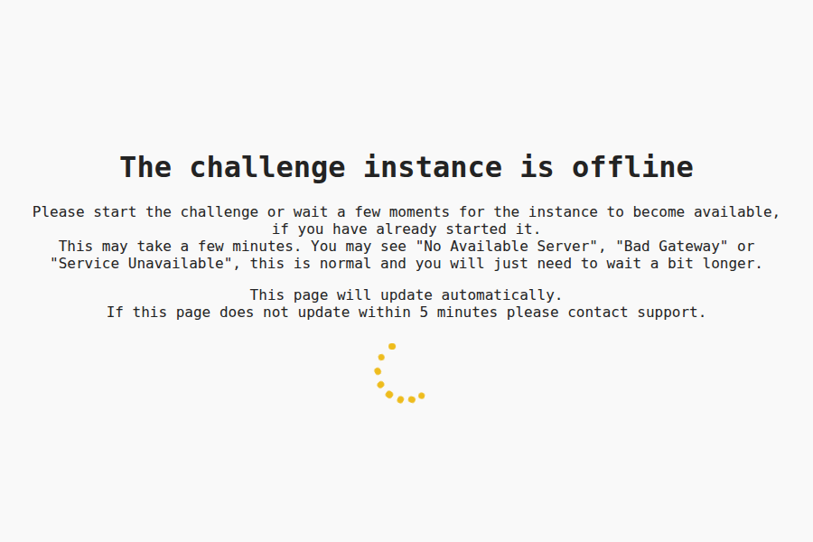
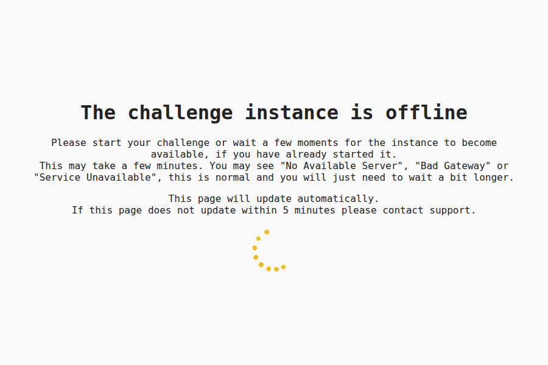
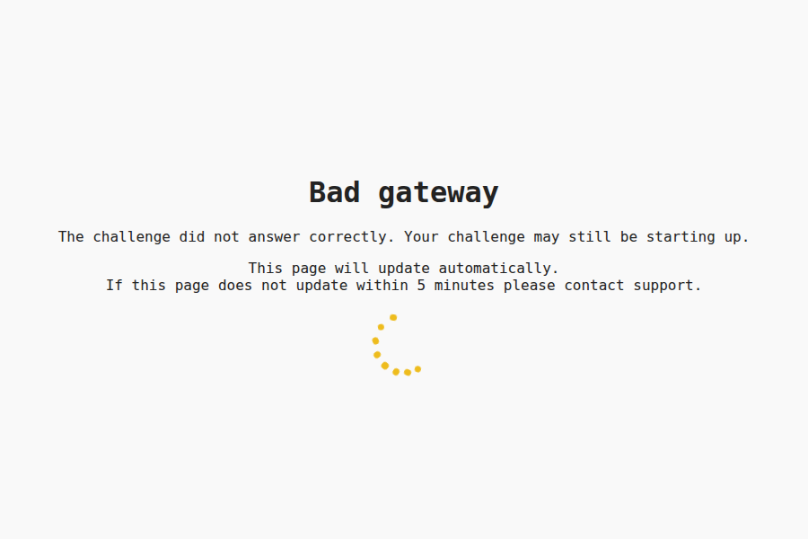
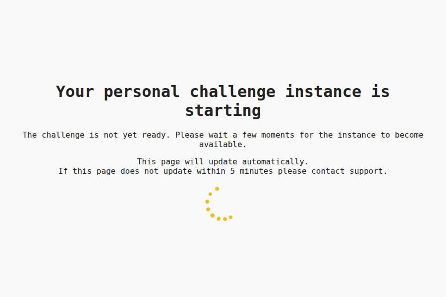
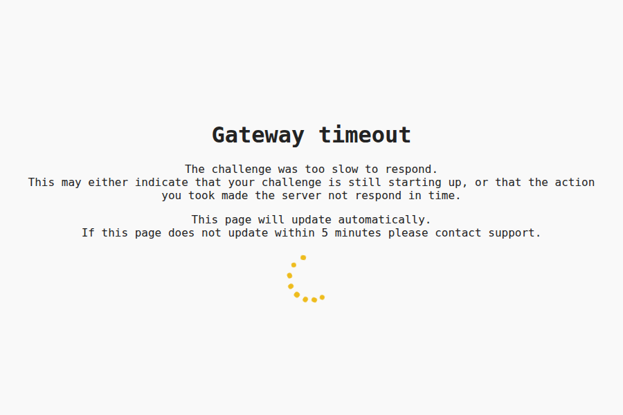
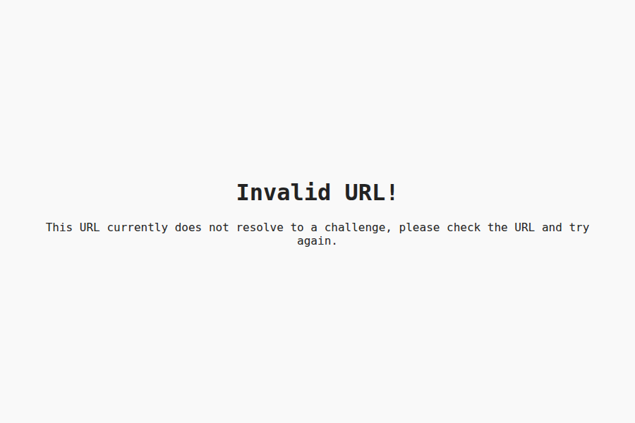

# CTF Pilot's Instancing Fallback

**Challenge instancing fallback webserver**

This repository contains a webserver, which is used as the fallback webserver for instancing.  
It serves both "Challenge offline", "Challenge starting" and error pages for the challenge management ecosystem.

## How to run

For Kubernetes environments, deploy the deployment file provided in `k8s`.  
This can be done with `kubectl`:

```sh
kubectl apply -f k8s/k8s.yml
```

The service can also be run locally, using the provided Docker compose file:

```sh
docker compose up -d
```

## Pages

Each page is generated from a file in [`src/content`](./src/content) (see [Development](#development) below) and is served as static HTML behind a reverse proxy, similarly to [`error-fallback`](https://github.com/ctfpilot/error-fallback). Which page is shown is determined by whichever HTTP status code the proxy maps to this service.

Unlike `error-fallback`, the page content is hidden until client-side JavaScript decides which of two states to show, based on whether the request's subdomain matches the expected `<slug>-<16 hex chars>` challenge-instance pattern:

- **Valid instance subdomain**: shows the page's "instance is offline/starting" message below, and polls the origin every few seconds, reloading automatically once the real challenge instance responds.
- **Anything else** (e.g. a misconfigured or unmapped domain): shows a generic **"Invalid URL!"** message instead, regardless of which page was requested.

If JavaScript is disabled entirely, neither state is shown; a plain warning that automatic reloading is unavailable is displayed instead.

| Page        | Title (valid subdomain)                     | Intended use                                                                  |
| ----------- | -------------------------------------------- | ------------------------------------------------------------------------------ |
| `index.html` | The challenge instance is offline            | Default fallback page, e.g. when there is no more specific error page          |
| `404.html`   | The challenge instance is offline            | Same message as `index.html` (minor wording difference only)                   |
| `502.html`   | Bad gateway                                  | The challenge did not answer correctly, it may still be starting up            |
| `503.html`   | Your personal challenge instance is starting | The challenge is not yet ready                                                 |
| `504.html`   | Gateway timeout                              | The challenge was too slow to respond                                          |

<details>
<summary>Preview of each page (valid subdomain state)</summary>

| | |
| --- | --- |
| **Index**  | **404**  |
| **502 Bad gateway**  | **503 Starting**  |
| **504 Gateway timeout**  | |

</details>

<details>
<summary>Preview of the "Invalid URL" state (shown on every page for a non-matching subdomain)</summary>



</details>

### Development

In order to generate the pages, run the [`generator.py`](./src/generator.py) script in `src`:

```sh
python3 src/generator.py
```

*This is done automatically in the Docker container build process.*

## Contributing

We welcome contributions of all kinds, from **code** and **documentation** to **bug reports** and **feedback**!

Please check the [Contribution Guidelines (`CONTRIBUTING.md`)](/CONTRIBUTING.md) for detailed guidelines on how to contribute.

To maintain the ability to distribute contributions across all our licensing models, **all code contributions require signing a Contributor License Agreement (CLA)**.
You can review **[the CLA here](https://github.com/ctfpilot/cla)**. CLA signing happens automatically when you create your first pull request.  
To administrate the CLA signing process, we are using **[CLA assistant lite](https://github.com/marketplace/actions/cla-assistant-lite)**.

*A copy of the CLA document is also included in this repository as [`CLA.md`](CLA.md).*  
*Signatures are stored in the [`cla` repository](https://github.com/ctfpilot/cla).*

## License

This schema and repository is licensed under the **EUPL-1.2 License**.  
You can find the full license in the **[LICENSE](LICENSE)** file.

We encourage all modifications and contributions to be shared back with the community, for example through pull requests to this repository.  
We also encourage all derivative works to be publicly available under the **EUPL-1.2 License**.  
At all times must the license terms be followed.

For information regarding how to contribute, see the [contributing](#contributing) section above.

CTF Pilot is owned and maintained by **[The0Mikkel](https://github.com/The0mikkel)**.  
Required Notice: Copyright Mikkel Albrechtsen (<https://themikkel.dk>)

## Code of Conduct

We expect all contributors to adhere to our [Code of Conduct](/CODE_OF_CONDUCT.md) to ensure a welcoming and inclusive environment for all.
